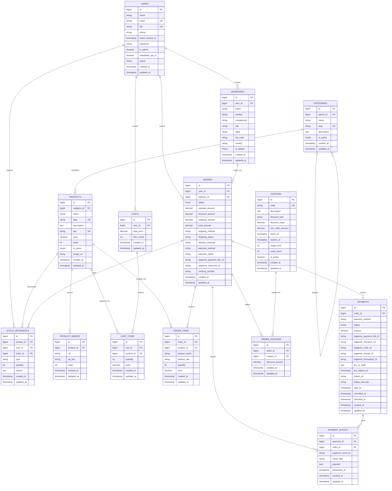

# Diagrama do banco de dados

Este diagrama foi gerado a partir das migrations e models do projeto. Ele foca nas tabelas de dominio da loja: usuarios, catalogo, carrinho, pedidos, pagamentos, cupons e estoque.

## Observacoes

- `order_coupons` representa a relacao N:N entre `orders` e `coupons`, guardando tambem o desconto aplicado no pedido.
- `payment_events` pode apontar para `payments` e/ou `orders`; ambas as chaves sao nullable na migration.
- `stock_movements.user_id` e `stock_movements.order_id` tambem sao nullable, porque uma movimentacao pode nao estar ligada a usuario ou pedido.
- `categories.parent_id` permite hierarquia de categorias.
- `order_items.product_name` e `order_items.product_sku` sao snapshots do produto no momento da compra.

## Tabelas de infraestrutura Laravel

Estas tabelas existem no projeto, mas ficaram fora do ERD principal por nao fazerem parte direta do dominio da loja:

- `password_reset_tokens`
- `sessions`
- `cache`
- `cache_locks`
- `jobs`
- `job_batches`
- `failed_jobs`
